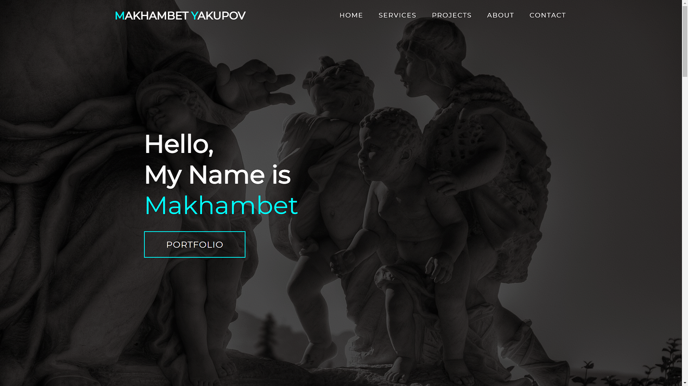
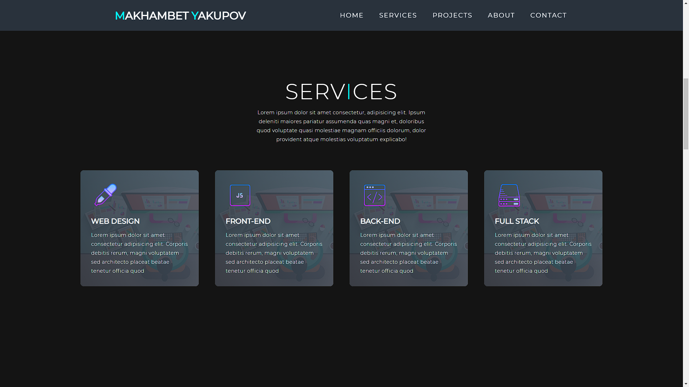
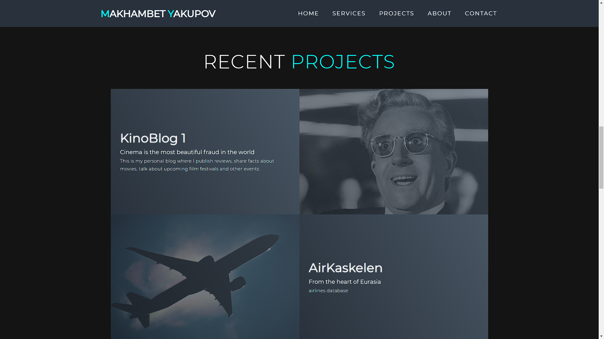
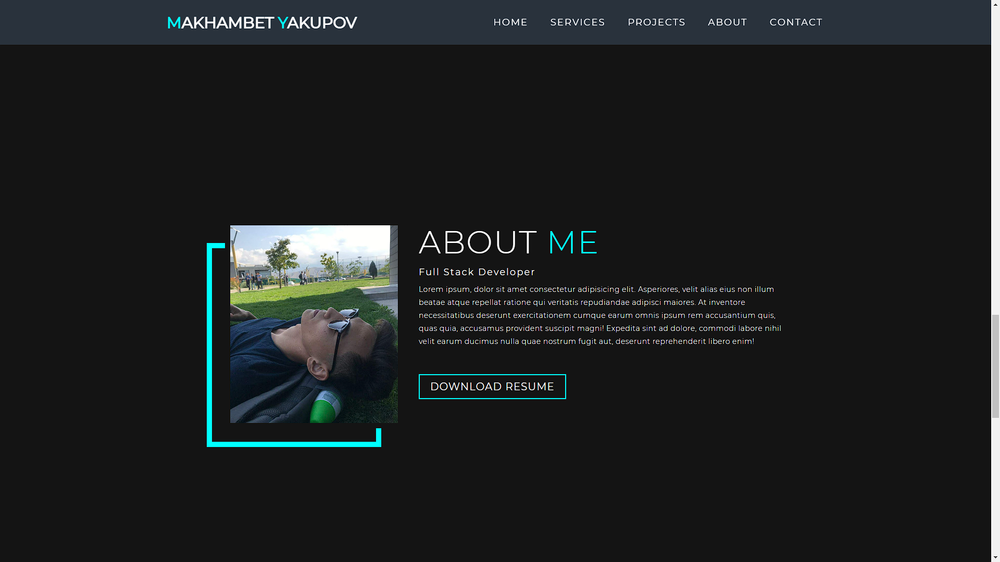

# Portfolio

This is my portfolio.
(The site itself is not three-page, but there are links to my own sites, so we can assume that the site is three-page)
First, we are greeted by an inscription with my name and navigation bar with which you can switch between sections.

In the services section you can see the services that I offer.

in the recent projects section I've posted links to my projects.

The about me section contains all the relevant information you need to know about me.

And at the end of the page, you will find a block with my contacts

